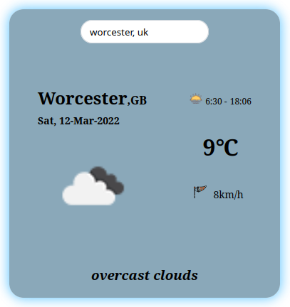

# Weather API

A straightforward weather API utilizing [The Open Weather Map](https://api.openweathermap.org/api).

## Overview

This weather API provides information about the current temperature, wind status, sunrise and sunset times, as well as additional details about weather conditions.

## Screenshot
<p style="text-align:center; transform: scale(0.8,0.8)">
    
</p>

## How to Use

### 1. Get API Key

- Sign in to [The Open Weather Map](https://api.openweathermap.org/api) to obtain your API key.

### 2. Configure API Key

- Open the `weather.js` file in the project directory.
- Replace the placeholder `YOUR_API_KEY_HERE` with your actual API key:
  ```javascript
  const WEATHER_API = 'YOUR_API_KEY_HERE';

## Installation

    ```
    git clone https://github.com/martindocs/weather-api.git

    # Navigate to the project directory
    cd weather-api

    # If you have Live Server installed, visit http://localhost:5500
    
    # Otherwise, simply double-click on index.html
    ```

## Contributing

Pull requests are much appreciated and accepted.

1. <a href='https://help.github.com/articles/fork-a-repo/'>**Fork**</a> the repo on GitHub.
2. <a href='https://help.github.com/articles/cloning-a-repository/'>**Clone**</a> the project to your own machine.
3. <a href='https://git-scm.com/book/en/v2/Git-Basics-Recording-Changes-to-the-Repository'>**Commit**</a> changes to <a href='https://git-scm.com/book/en/v2/Git-Branching-Branches-in-a-Nutshell'>**development branch**</a>.
4. <a href='https://help.github.com/articles/pushing-to-a-remote/'>**Push**</a> your work back up to your fork.
5. Submit a <a href='https://help.github.com/articles/about-pull-requests/'>**Pull request**</a> so that i can review your changes

## Credits

N/A (Open for contributions).

## License

Please refer to the [LICENSE](./LICENSE.md) file in this repository for details on how this project is licensed.
